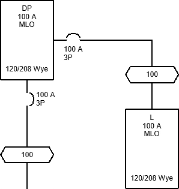

# Creating Distribution Equipment

Create and power distribution equipment both in the Revit model and on the one-line diagram.

Start in the <dtitle>ONE-LINE DIAGRAM</dtitle> drafting view.

## Create and Power Panel L

1. Run the <dmcommand>DM One-Line→  Insert Create</dmcommand> command. The <dtitle>Create Equipment</dtitle> dialog box will open.
2. Set <tfield>Callout</tfield> to <value>L</value>.
3. Set <lfield>Level</lfield> to <value>FIRST FLOOR</value>.
4. Set <dfield>Distribution System</dfield> to <value>120/208 Wye</value>.
5. Set <lfield>Model Family</lfield> to <value>Lighting and Appliance Panelboard - 208V MLO - Surface</value>.
6. Press the <button>OK</button> button to close the dialog box.
7. Insert the panel on the drafting view. You will be prompted to select a distribution equipment to power the panel.
8. Select panel DP.

A feeder will be drawn between panel DP and panel L.

## Find and Move Panel L in the Model

1. Run the <dmcommand>DM One-Line→  Highlight Device</dmcommand> command.
2. Select panel L. The <dtitle>FIRST FLOOR POWER</dtitle> floor plan will open with panel L highlighted.
3. Select panel L and go to the Revit <dtitle>Electrical Circuits</dtitle> tab. The <sparam>Panel</sparam> and <sparam>Distribution System</sparam> fields reflect the settings configured in the steps above.
4. Run the Revit <acommand>Modify | Electrical Equipment→  Pick New</acommand> command.
5. Move panel L beside panel B inside the building.

Optionally, you can use the Revit <acommand> Tag by Category</acommand> command to label panel L on the floor plan.