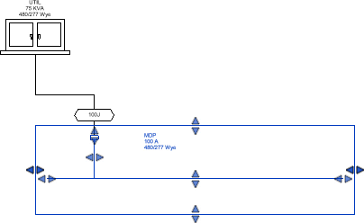
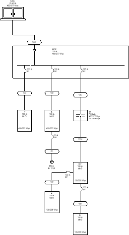

# Inserting Distribution Equipment

Insert distribution equipment from the Revit model onto the one-line diagram.

Start in the <dtitle>ONE-LINE DIAGRAM</dtitle> drafting view.

## Insert UTIL from the Model

1. Run the <dmcommand>DM One-Line→  Insert Link</dmcommand> command. The <dtitle>Insert Distribution Equipment</dtitle> dialog box will open.
2. Set <lfield>Tree</lfield> to <value>UTIL</value>.
3. Set <lfield>One-Line Diagram Graphic</lfield> to <value>Utility Transformer</value>.
4. Press the <button>OK</button> button to close the dialog box.
5. Insert the transformer on the drafting view.

## Insert MDP from the Model

1. Run the <dmcommand>DM One-Line→  Insert Link</dmcommand> command. The <dtitle>Insert Distribution Equipment</dtitle> dialog box will open.
2. Set <lfield>Tree</lfield> to <value>MDP</value>.
3. Set <lfield>One-Line Diagram Graphic</lfield> to <value>Switchboard, Horizontal, Fed from Top</value>.
4. Press the <button>OK</button> button to close the dialog box.
5. Insert the panel below UTIL on the drafting view.
6. Select panel MDP and use the grips provided to extend the right side of the graphic.
   

## Insert P and E from the Model

1. Run the <dmcommand>DM One-Line→  Insert Link</dmcommand> command. The <dtitle>Insert Distribution Equipment</dtitle> dialog box will open.
2. Set <lfield>Tree</lfield> to <value>P</value>.
3. Press the <button>OK</button> button to close the dialog box.
4. Insert the panel below panel MDP on the drafting view.
5. Run the <dmcommand>DM One-Line→  Copy Link</dmcommand> command.
6. Select panel P on the drafting view. The <dtitle>Select Distribution Equipment to Link</dtitle> dialog box will open.
7. Set <lfield>Tree</lfield> to <value>E</value>.
8. Press the <button>OK</button> button to close the dialog box.
9. Insert the panel to the right of panel P on the drafting view.

## Insert Branch Circuit Devices and Additional Distribution Equipment from the Model

1. Open the <dtitle>FIRST FLOOR POWER</dtitle> floor plan.
2. Run the <dmcommand>DM One-Line→  Insert Link</dmcommand> command. You will be prompted to select a device from the model.
3. Select the elevator motor on the floor plan. You will then be prompted to select a drafting view.
4. Press <key>ESC</key>. The <dtitle>Select Drafting View</dtitle> dialog box will open.
5. Set <lfield>Drafting View</lfield> to <value>ONE-LINE DIAGRAM</value>.
6. Check the box next to <cbox>Set as default one-line diagram view</cbox>.
7. Press the <button>OK</button> button. The <dtitle>Insert Distribution Equipment</dtitle> dialog box will open.
8. Press the <button>OK</button> button to close the dialog box.
9. Insert the motor below panel E on the drafting view.

Continue using the <dmcommand> Insert Link</dmcommand> and <dmcommand> Copy Link</dmcommand> commands to insert the remaining distribution equipment from the model.

