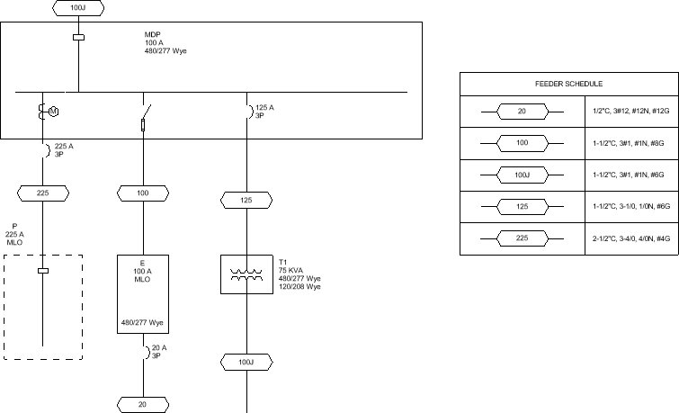

# Inserting the Feeder Schedule

Insert and update the feeder schedule on the one-line diagram.

Start in the <dtitle>ONE-LINE DIAGRAM</dtitle> drafting view.

## Insert the Feeder Schedule

1. Run the <dmcommand>DM One-Line→  Schedule Insert</dmcommand> command.
2. Follow the prompts to insert the feeder schedule on the drafting view.

## Update the Feeder Schedule

1. Run the <dmcommand>DM One-Line→  Edit</dmcommand> command.
2. Select panel P. The <dtitle>Panel Edit</dtitle> dialog box will open.
3. Set <dfield>Bus Size / Mains</dfield> to <value>225</value>.
4. Press the <button>Exit</button> button to close the dialog box. The labels on panel P, the feeder ID, and the OCP graphic will update to reflect the changes.
5. Run the <dmcommand>DM One-Line→  Schedule Insert</dmcommand> command.

The feeder schedule will be updated in its current location to include the new feeder ID and callout.

