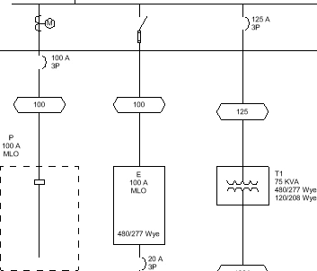

# Modifying Graphics

Modify distribution equipment and feeder graphics on the one-line diagram.

Start in the <dtitle>ONE-LINE DIAGRAM</dtitle> drafting view.

## Modify Distribution Equipment Graphics

1. Run the <dmcommand>DM One-Line→  Add/Modify Graphic</dmcommand> command.
2. Select panel P. The <dtitle>Modify Graphic</dtitle> dialog box will open.
3. Set <lfield>One-Line Diagram Graphic</lfield> to <value>Panel with Bus, Fed from Top</value>.
4. Set <lfield>One-Line Diagram Type</lfield> to <value>Dashed</value>.
5. Press the <button>OK</button> button to close the dialog box.

The graphic for panel P will be updated.

6. Select <button>Update labels</button> to use the default tags and tag locations for the graphic.
7. Select the "P" label on the drafting view.
8. Using the <dtitle>Properties</dtitle> panel, set the tag to <value>DME-TAG-Panel-Name_Bus Size_Disconnect-C</value>.
9. Use the grip provided to move the label.

## Modify Feeder Graphics

1. Run the <dmcommand>DM One-Line→  Add/Modify Graphic</dmcommand> command.
2. On the feeder between panel MDP and panel P, select a point between the OCP graphic and feeder ID graphic.
3. Select <button>Add an additional graphic</button>. The <dtitle>Select Feeder Graphic</dtitle> dialog box will open.
4. Set <dfield>Group</dfield> to <value>Meter</value>.
5. Press the <button>OK</button> button to close the dialog box. A meter graphic will be added to the feeder at the point you specified.
6. Run the <dmcommand>DM One-Line→  Graphic Move</dmcommand> command.
7. Select the meter graphic, then the OCP graphic. The graphics will change places along the feeder.
8. Run the <dmcommand>DM One-Line→  Add/Modify Graphic</dmcommand> command.
9. On the feeder between panel MDP and panel E, select the OCP graphic.
10. Select <button>Replace existing OCP graphic</button>. The <dtitle>Select OCP Graphic</dtitle> dialog box will open.
11. Set <dfield>Group</dfield> to <value>Switch</value>.
12. Press the <button>OK</button> button to close the dialog box.

The OCP graphic on the feeder will be updated.

