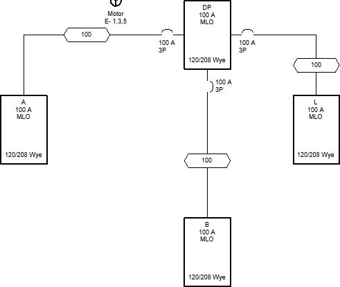

# Moving Distribution Equipment and Feeders

Move distribution equipment and feeders on the one-line diagram.

Start in the <dtitle>ONE-LINE DIAGRAM</dtitle> drafting view.

## Move Distribution Equipment and Feeders

1. Select Panel A.
2. Run the Revit <acommand>Modify→  Move (MV)</acommand> command.
3. Move panel A to a new location.
4. Run the <dmcommand>DM One-Line→  Feeder Draw</dmcommand> command.
5. Select panel A. The upstream feeder will disappear and you will be prompted to specify the starting location of the new feeder.
6. Follow the prompts to draw a new feeder between panel DP and panel A.
7. Press <key>ESC</key> to finish the command.
8. Repeat steps 1-3 for panel B.
9. Run the <dmcommand>DM One-Line→  Feeder Reset</dmcommand> command.
10. Select the feeder between panel DP and panel B. The feeder will disappear and you will be prompted to specify the starting location of the new feeder.
11. Press ESC to insert the feeder using the default connection points.
